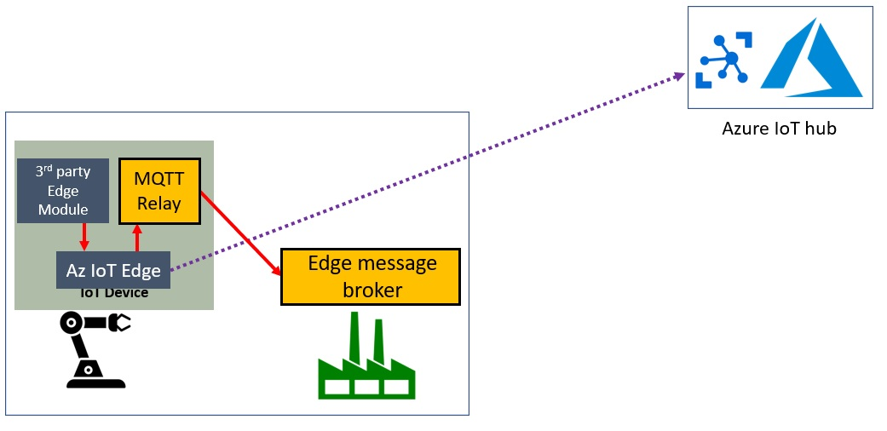

# MQTT Relay IoT Edge module 

The is an Azure IoT Edge Custom Module that relays MQTT data to a local MQTT broker

The following environment variables of the local MQTT broker are needed:
- DESTINATION_MQTT_TOPIC      
- DESTINATION_MQTT_BROKER_FQDN
- DESTINATION_MQTT_BROKER_PORT

